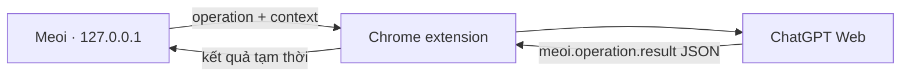

# Meoi Bridge v2 — ChatGPT Web trực tiếp, không MCP

Meoi chạy trên máy người dùng và dùng Chrome extension để gửi yêu cầu vào tab `chatgpt.com`. ChatGPT trả lesson, evaluation hoặc coaching dưới dạng JSON đầy đủ; extension chuyển kết quả thẳng về Meoi để hiển thị trong phiên hiện tại.



Luồng này:

- Không dùng `@Meoi`, MCP, OAuth, OpenAI API, SDK hoặc API key.
- Không gọi Cloudflare Worker và không ghi D1/database.
- Không lưu lesson/evaluation/coaching vào `localStorage`. Kết quả chỉ tồn tại trong React state của trang hiện tại và biến mất khi reload.
- Queue, prompt và kết quả chờ nhận dùng `chrome.storage.session`: chịu được Manifest V3 service worker tạm dừng nhưng tự mất khi đóng phiên trình duyệt. Meoi ACK và xóa kết quả ngay sau khi validate và sử dụng.
- Chỉ `unitId → ChatGPT conversation URL` được giữ trong `chrome.storage.local` để mỗi unit tiếp tục dùng một chat.
- Extension chỉ đọc assistant turn mới do operation Meoi vừa gửi; không đọc lịch sử, user message, cookie hoặc network nội bộ.

## Chạy website và extension

Yêu cầu Node.js 22 LTS hoặc mới hơn. Máy này có Node 22 portable trong `.tools/`.

```powershell
$env:PATH = "$(Resolve-Path '.\.tools\node-v22.23.1-win-x64');$env:PATH"
npm run build:extension
npm run dev
```

Sau đó:

1. Mở `chrome://extensions`, bật **Developer mode**, chọn **Load unpacked** và trỏ tới `dist-extension`.
2. Nếu extension đã được load từ thư mục này, bấm **Reload** rồi refresh cả tab Meoi và ChatGPT.
3. Đăng nhập `https://chatgpt.com/`. Không cần cài app/MCP hoặc tạo mã ghép.
4. Mở `http://127.0.0.1:5173`, chuyển sang **Learn**, chọn unit và bấm **Tạo bài học**.
5. Extension mở đúng chat của unit, gửi prompt tự chứa context, chờ JSON và chuyển kết quả về Meoi. Extension không tự chuyển tiêu điểm về Meoi.

ChatGPT Free vẫn chịu quota của tài khoản. Nếu JSON sai schema, extension gửi tối đa ba follow-up trong cùng chat để sửa định dạng. Follow-up không gọi MCP, app hoặc công cụ lưu dữ liệu.

## Contract kết quả

Wire protocol hiện là v3 để không nhận nhầm state từ các build thử nghiệm cũ. Ví dụ coaching thành công:

```json
{
  "type": "meoi.operation.result",
  "protocolVersion": 3,
  "operationId": "...",
  "kind": "coaching",
  "outcome": "completed",
  "result": { "coachingReply": "..." }
}
```

Các kind text được hỗ trợ:

- `create_lesson` → `result.lesson`, hoặc `needs_source` → `result.sourceRequest`.
- `evaluate_answer` → `result.evaluation`.
- `coaching` → `result.coachingReply`.

Parser chấp nhận JSON thuần hoặc đúng một fenced block `json`, giới hạn 1 MiB, kiểm tra operation ID/kind/envelope và từ chối output mơ hồ. Lesson và evaluation tiếp tục được Meoi validate trước khi render.

Audio không được tải lên trong chế độ tạm thời; speaking chỉ gửi transcript/metadata và không chấm phát âm. Nút Voice chỉ mở đúng chat của unit, không đồng bộ hoặc lưu phiên Voice.

## Test và build

```powershell
$env:PATH = "$(Resolve-Path '.\.tools\node-v22.23.1-win-x64');$env:PATH"
npm run test
npm run build
```

`npm run build` chỉ tạo website và extension.

Workspace/domain data hiện có của Meoi vẫn dùng cơ chế browser-local của ứng dụng. Thay đổi “không lưu” trong Bridge v2 chỉ áp dụng cho nội dung tạo/chấm/coaching nhận từ ChatGPT.
