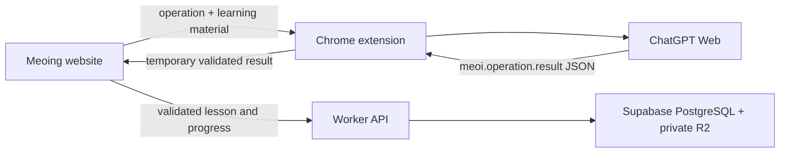

# Meoing frontend

This package contains the React website and the Meoi Bridge Chrome extension.

## Cloud website and Meoi Bridge v8

The website requires Supabase authentication and stores application data through
the Meoing Worker API. The Chrome extension still performs lesson generation and
answer evaluation through an existing `chatgpt.com` tab; it validates each result
before returning it to the signed-in website.



This flow:

- Does not use `@Meoi`, MCP, the OpenAI API, an SDK, or an API key.
- Does not ask ChatGPT to call the Worker, database, MCP, or any persistence
  tool.
- Saves validated lessons and progress through the Worker API; it never uses
  `localStorage` as an application source of truth.
- Uses `chrome.storage.session` for queued prompts and validated results so the
  Manifest V3 worker can sleep safely. Meoing acknowledges and removes each
  result after the Worker has accepted it.
- On a webpage reload, asks the extension for the latest unacknowledged lesson
  operation for the selected unit and resumes polling or cloud persistence with
  the same `operationId`; the webpage does not persist operation state locally.
- Keeps only `unitId -> ChatGPT conversation URL` in `chrome.storage.local`, so
  each unit can continue in one conversation.
- Reads only the new assistant turn created for the operation. It does not read
  earlier history, user messages, cookies, or internal network traffic.

IndexedDB is used only as a temporary retry outbox for unacknowledged progress
batches. A batch is deleted as soon as the Worker confirms it; terminal
rejections are exposed for retry or discard. Signing out first attempts a final
sync and then clears any remaining outbox records for that account from the
device.

## Run the website and extension

Use Node.js 22 LTS or newer. From the monorepo root:

```powershell
$env:PATH = "$(Resolve-Path '.\.tools\node-v22.23.1-win-x64');$env:PATH"
Copy-Item frontend/.env.example frontend/.env.local
npm --prefix frontend run build:extension
npm --prefix frontend run dev
```

Then:

1. Configure `frontend/.env.local` for the local Worker and Supabase project.
2. Open `chrome://extensions`, enable **Developer mode**, choose **Load
   unpacked**, and select `frontend/dist-extension`.
3. If it is already loaded from that folder, click **Reload**, then refresh both
   the Meoing and ChatGPT tabs.
4. Sign in at `https://chatgpt.com/`. The extension itself needs no MCP setup,
   pairing code, OAuth flow, or API key.
5. Open `http://127.0.0.1:5173`, authenticate with a verified account, complete
   username onboarding, switch to **Learn**, select a unit, and click **Create
   lesson**.
6. The extension sends the self-contained prompt, waits for validated JSON, and
   returns it to Meoing. The website saves it through the Worker before
   acknowledging the extension result.

ChatGPT account quotas still apply. If a response fails validation, the
extension sends up to three repair follow-ups in the same conversation without
invoking a tool or repeating the learning task.

## Result contract

The page and extension use wire protocol v8. A successful coaching result looks
like this:

```json
{
  "type": "meoi.operation.result",
  "protocolVersion": 8,
  "operationId": "...",
  "kind": "coaching",
  "outcome": "completed",
  "result": { "coachingReply": "..." }
}
```

Supported text operations:

- `create_lesson` -> `result.lesson`, or `needs_source` ->
  `result.sourceRequest`
- `evaluate_answer` -> `result.evaluation`
- `coaching` -> `result.coachingReply`

The parser accepts raw JSON or exactly one standalone `json` fence, rejects
surrounding commentary and extra fields, and limits responses to 1 MiB. Lesson
and evaluation objects are deeply validated before they leave the ChatGPT tab.
A lesson must also match the expected unit, language, level, exact question
count, enabled formats, required custom blueprints, grading modes, and speaking
setting.

Audio is not uploaded. Speaking evaluation sends only transcript and timing
metadata and does not claim pronunciation assessment. The Voice button opens
the unit's conversation but does not sync or save a Voice session.

## Test and build

```powershell
$env:PATH = "$(Resolve-Path '.\.tools\node-v22.23.1-win-x64');$env:PATH"
npm --prefix frontend run test
npm --prefix frontend run build
```

`npm --prefix frontend run build` creates the website and unpacked extension
output under `frontend/`. Production extension builds must set
`MEOI_WEB_ORIGINS` to the comma-separated HTTPS origins allowed to communicate
with Meoi Bridge. Deployment workflows also set
`MEOI_REQUIRE_WEB_ORIGINS=true`, so a missing production allowlist fails the
build instead of silently emitting a localhost-only extension.
