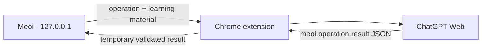

# Meoing Frontend

This package contains the Meoi React website and the Meoi Bridge Chrome extension.

## Meoi Bridge v5 - ChatGPT Web, no API or MCP

Meoi runs on the user's device. Its Chrome extension sends requests through an existing `chatgpt.com` tab, validates the returned lesson, evaluation, or coaching JSON, and passes that result back to the current Meoi page.



This flow:

- Does not use `@Meoi`, MCP, OAuth, the OpenAI API, an SDK, or an API key.
- Does not call a Cloudflare Worker or write to D1 or another database.
- Does not save ChatGPT lessons, evaluations, or coaching to `localStorage`. They live in the current React page state and disappear on reload.
- Uses `chrome.storage.session` for queued prompts and validated results so the Manifest V3 worker can sleep safely. Meoi acknowledges and removes results after use.
- Keeps only `unitId → ChatGPT conversation URL` in `chrome.storage.local`, allowing each unit to continue in one conversation.
- Reads only the new assistant turn created for the operation. It does not read earlier history, user messages, cookies, or internal network traffic.

## Run the website and extension

Run these commands from the monorepo root. Use Node.js 22 LTS or newer. The repository includes a portable Node 22 runtime under `.tools/`.

```powershell
$env:PATH = "$(Resolve-Path '.\.tools\node-v22.23.1-win-x64');$env:PATH"
npm --prefix frontend run build:extension
npm --prefix frontend run dev
```

Then:

1. Open `chrome://extensions`, enable **Developer mode**, choose **Load unpacked**, and select `frontend/dist-extension`.
2. If it is already loaded from that folder, click **Reload**, then refresh both the Meoi and ChatGPT tabs.
3. Sign in at `https://chatgpt.com/`. No app, MCP setup, pairing code, OAuth flow, or API key is needed.
4. Open `http://127.0.0.1:5173`, switch to **Learn**, select a unit, and click **Create lesson**.
5. The extension opens that unit's conversation, sends the self-contained prompt, waits for validated JSON, and returns it to Meoi. It does not move focus back to Meoi when finished.

ChatGPT account quotas still apply. If a response fails validation, the extension sends up to three repair follow-ups in the same conversation without invoking a tool or repeating the learning task.

## Result contract

The page and extension use wire protocol v5. A successful coaching result looks like this:

```json
{
  "type": "meoi.operation.result",
  "protocolVersion": 5,
  "operationId": "...",
  "kind": "coaching",
  "outcome": "completed",
  "result": { "coachingReply": "..." }
}
```

Supported text operations:

- `create_lesson` → `result.lesson`, or `needs_source` → `result.sourceRequest`
- `evaluate_answer` → `result.evaluation`
- `coaching` → `result.coachingReply`

The parser accepts raw JSON or exactly one standalone `json` fence, rejects surrounding commentary and extra fields, and limits responses to 1 MiB. Lesson and evaluation objects are deeply validated before they leave the ChatGPT tab. A lesson must also match the expected unit, language, level, exact question count, enabled formats, required custom blueprints, grading modes, and speaking setting.

Audio is not uploaded. Speaking evaluation sends only transcript and timing metadata and does not claim pronunciation assessment. The Voice button opens the unit's conversation but does not sync or save a Voice session.

## Test and build

```powershell
$env:PATH = "$(Resolve-Path '.\.tools\node-v22.23.1-win-x64');$env:PATH"
npm --prefix frontend run test
npm --prefix frontend run build
```

`npm --prefix frontend run build` creates only the website and unpacked extension output under `frontend/`. Existing workspace/library data remains browser-local; the temporary-data rule applies specifically to content returned through Meoi Bridge.
